# FinAgent Platform Runbook

This repository is the GitOps and environment-configuration source of truth for the FinAgent platform. It contains the Helm charts, Argo CD application definitions, infrastructure manifests, and Helm-repo CI needed to deploy and operate the application across environments.

This runbook documents:
- Kubernetes platform layout
- GitOps deployment flow
- CI/CD pipeline triggers
- secret management
- domain and ingress routing
- verification steps
- screenshots and workflow evidence

## 1. Platform Summary

FinAgent is deployed as a Kubernetes-based microservices platform with:
- a public HAProxy edge server that receives user traffic
- a private Kubernetes subnet containing the control plane and worker nodes
- namespace isolation for apps, databases, gateway, keycloak, and monitoring
- internal-only service communication through `ClusterIP`
- a shared `Gateway API` entry layer inside the cluster
- per-service application Helm charts managed from this repo
- environment-specific GitOps layouts for `test` and `prod`
- NFS-backed dynamic provisioning for persistent storage
- an Ollama runtime deployed on a GPU-capable node for LLM inference

## 2. Repository Role

This repo is responsible for:
- environment root applications for Argo CD
- infrastructure charts such as namespaces, gateway, storage, mysql, ollama, monitoring
- application Helm charts for frontend, auth, chat, expense, and insights services
- test and production values separation
- policy validation for production-bound Helm changes

## 3. Kubernetes and GitOps Walkthrough

### 3.1 Edge and Network Layout

The deployed platform is designed around two network zones:
- `Public subnet`: contains the HAProxy server that receives user traffic over the domain
- `Private subnet`: contains the Kubernetes cluster and internal services

HAProxy is the public entry point. It terminates or forwards inbound traffic at the edge, and the Kubernetes platform handles internal routing after traffic enters the cluster.

### 3.2 Cluster Layout

The cluster design includes:
- `1 control plane / master node`
- `3 worker nodes` for application workloads
- `1 GPU-capable worker node` used for Ollama / Llama inference workloads

Application workloads are scheduled on worker nodes, while AI inference is isolated onto the GPU node.

### 3.3 Namespace Layout

The namespace chart defines the following namespaces:

| Namespace | Purpose |
|---|---|
| `finagent-apps` | Application services such as frontend, auth, chat, expense, and insights |
| `finagent-dbs` | MySQL databases and Ollama runtime |
| `finagent-gateway-ns` | Shared Gateway API resources |
| `keycloak` | Identity provider and OIDC |
| `monitoring` | Grafana, Prometheus, Loki, and Promtail |

Current namespace values are defined in [`infra/namespaces/values.yaml`](./infra/namespaces/values.yaml).

### 3.4 Gateway and Routing

The shared gateway is defined in [`infra/finagent-gateway/values.yaml`](./infra/finagent-gateway/values.yaml):
- gateway name: `finagent-gateway`
- gateway namespace: `finagent-gateway-ns`
- gateway class: `kgateway`
- listener: `HTTP` on port `80`
- namespace access restricted with the `shared-gateway: "true"` selector

Application and tool routes use `HTTPRoute` resources to bind to the shared gateway.

### 3.5 Persistent Storage and NFS

This repo includes a dedicated NFS-backed storage class:
- chart: [`infra/nfs-storageclass`](./infra/nfs-storageclass)
- provisioner is defined in the chart values
- storage is dynamically provisioned through `StorageClass`

Persistent workloads using NFS-backed storage include:
- MySQL databases
- Grafana / Prometheus / Alertmanager
- Ollama model storage

### 3.6 Ollama and GPU Usage

Ollama is managed in [`infra/ollama`](./infra/ollama). The current values show:
- namespace: `finagent-dbs`
- storage class: `finagent-nfs`
- PVC size: `20Gi`
- model pull enabled
- current model: `llama3.2:3b`
- node selector pinned to a specific node hostname

This means:
- the model runtime is kept separate from application namespaces
- model files persist across pod restarts
- inference workloads can be tied to the GPU node

### 3.7 Database Access Isolation

Database ingress is restricted by network policy in [`infra/mysql/templates/networkpolicy.yaml`](./infra/mysql/templates/networkpolicy.yaml).

At the moment, the committed network policy explicitly allows only:
- `finagent-auth-service`
- `finagent-expense-service`

to reach MySQL on port `3306`.

## 4. Environment Structure

This repository follows an App-of-Apps GitOps model.

### 4.1 Root Applications

For each environment, two Argo CD root applications are used:
- `infra-root`
- `apps-root`

Current files:
- [`env/test/root/infra-root.yaml`](./env/test/root/infra-root.yaml)
- [`env/test/root/apps-root.yaml`](./env/test/root/apps-root.yaml)
- [`env/prod/root/infra-root.yaml`](./env/prod/root/infra-root.yaml)
- [`env/prod/root/apps-root.yaml`](./env/prod/root/apps-root.yaml)

These root apps point Argo CD to:
- `env/test/infra`
- `env/test/apps`
- `env/prod/infra`
- `env/prod/apps`

All root applications currently use:
- `targetRevision: main`
- automated sync
- `prune: true`
- `selfHeal: true`

### 4.2 Bootstrap Process

To bootstrap an environment, apply the two root applications for that environment.

Example for `test`:

```bash
kubectl apply -f env/test/root/infra-root.yaml
kubectl apply -f env/test/root/apps-root.yaml
```

Example for `prod`:

```bash
kubectl apply -f env/prod/root/infra-root.yaml
kubectl apply -f env/prod/root/apps-root.yaml
```

## 5. Application Charts

Application charts currently exist for:
- `finagent-frontend`
- `finagent-auth-service`
- `finagent-chat-service`
- `finagent-expense-service`
- `finagent-insights-service`

The charts currently live under:
- [`apps/test/finagent-frontend`](./apps/test/finagent-frontend)
- [`apps/test/finagent-auth-service`](./apps/test/finagent-auth-service)
- [`apps/test/finagent-chat-service`](./apps/test/finagent-chat-service)
- [`apps/test/finagent-expense-service`](./apps/test/finagent-expense-service)
- [`apps/test/finagent-insights-service`](./apps/test/finagent-insights-service)

Each application follows the same general pattern:
- image repository and tag in values
- config via `ConfigMap`
- secrets via `SealedSecret`
- internal service via `ClusterIP`
- external route via `HTTPRoute`

## 6. Domains and Access Points

### 6.1 Public Domains Confirmed in This Repo

| Domain | Purpose | Source |
|---|---|---|
| `myfinagent.online` | Frontend UI | [`apps/test/finagent-frontend/values-test.yaml`](./apps/test/finagent-frontend/values-test.yaml) |
| `argocd.myfinagent.online` | Argo CD UI | [`argo-route.yaml`](./argo-route.yaml) |
| `keycloak.myfinagent.online` | Keycloak UI / OIDC | [`env/test/infra/keycloak-route.yaml`](./env/test/infra/keycloak-route.yaml) |
| `k8s.myfinagent.online` | Headlamp UI | [`infra/headlamp/headlamp-route.yaml`](./infra/headlamp/headlamp-route.yaml) |
| `grafana.myfinagent.online` | Grafana UI | [`infra/monitoring/prometheus/values.yaml`](./infra/monitoring/prometheus/values.yaml) |

### 6.2 Internal Service Endpoints

Internal service discovery currently includes patterns like:
- `mysql-server.finagent-dbs.svc.cluster.local`
- `expense-service.finagent-apps.svc.cluster.local`
- `ollama.finagent-dbs.svc.cluster.local`

These are visible in the application `values-test.yaml` files.

### 6.3 API Route Note

The current committed `values-test.yaml` files for auth/chat/expense/insights still reference:
- `api.test.finagent.example.com`

So for the README, those are documented as the current chart values, while the platform access routes above are the clearly committed `myfinagent.online` domains already present in this repo.

## 7. Secret Management

### 7.1 Runtime Application Secrets

Application runtime secrets are stored as `SealedSecret` manifests rather than plain Kubernetes `Secret` YAML in Git.

Examples:
- [`apps/test/finagent-auth-service/templates/sealed-secret.yaml`](./apps/test/finagent-auth-service/templates/sealed-secret.yaml)
- similar `sealed-secret.yaml` files exist in auth, chat, expense, insights, and mysql charts

This provides:
- encrypted secret values in Git
- cluster-side decryption via the Sealed Secrets controller
- compatibility with GitOps workflows

### 7.2 GitHub Actions Secrets

The CI/CD workflows rely on repository or organization secrets such as:

| Secret | Used For |
|---|---|
| `SONAR_TOKEN` | SonarQube scan authentication |
| `SONAR_HOST_URL` | SonarQube server URL |
| `SONAR_PROJECT_KEY` | SonarQube project key |
| `SNYK_TOKEN` | Snyk authentication |
| `SNYK_ORG` | Snyk org/project URLs in notifications |
| `SNYK_PROJECT_ID` | Snyk project URL reference |
| `HELM_REPO_TOKEN` | Updating this Helm repo from app pipelines |
| `SMTP_USERNAME` / `SMTP_PASSWORD` | Email notifications |
| `MAIL_FROM` / `MAIL_TO` | Notification sender and fallback recipient |
| `SLACK_INCOMING_WEBHOOK` | Slack alerts |
| `GITHUB_TOKEN` | GHCR image push and repo operations |

### 7.3 Access Governance

This repo also includes Headlamp RBAC mappings in [`infra/headlamp/rbac.yaml`](./infra/headlamp/rbac.yaml), including:
- `headlamp-admins` bound to cluster-admin
- `dev` group scoped to `finagent-apps`
- `db` group scoped to `finagent-dbs`

## 8. CI/CD Pipeline Triggers

### 8.1 Microservice Repositories

All application repos follow the same pipeline pattern.

| Workflow | Trigger | Purpose |
|---|---|---|
| `ci.yaml` | PR `opened`, `synchronize` | PR validation with SonarQube first, then Snyk |
| `ci-image-pipeline.yaml` | PR `closed` to `main` | Gate merge + build image + update Helm test values |
| `release.yaml` | Release `published` | Promote SHA-tag image to semantic version |

### 8.2 PR Validation Flow

In the service repos:
- SonarQube runs first
- Snyk runs only if SonarQube passes
- failure notifications are sent by reusable notification actions

This is implemented to stop early and avoid wasting runner time.

Representative examples:
- [`../finagent-frontend/.github/workflows/ci.yaml`](../finagent-frontend/.github/workflows/ci.yaml)
- [`../finagent-auth-service/.github/workflows/ci.yaml`](../finagent-auth-service/.github/workflows/ci.yaml)

### 8.3 Gated Image Pipeline

The image pipeline is triggered when a PR to `main` is closed, but it only continues if:
- the PR was merged
- the PR has the `build` label
- at least one review is in `APPROVED` state

After passing the gate:
- Docker image is built
- image is pushed to GHCR
- the relevant `values-test.yaml` file in this repo is updated automatically

Representative example:
- [`../finagent-auth-service/.github/workflows/ci-image-pipeline.yaml`](../finagent-auth-service/.github/workflows/ci-image-pipeline.yaml)

### 8.4 Image Build Note

The reusable Docker build workflow currently:
- builds the container
- logs into GHCR
- pushes the SHA-based image tag

Important note:
- the Trivy scan section is currently scaffolded in the committed workflow but commented out in the current code state

Representative example:
- [`../finagent-auth-service/.github/workflows/ci-docker-build.yaml`](../finagent-auth-service/.github/workflows/ci-docker-build.yaml)

### 8.5 Release Promotion

On GitHub Release publication:
- the semantic version is validated
- the workflow resolves the SHA for the release tag
- the SHA-based GHCR image is pulled
- the image is re-tagged, for example `v1.0.0`
- the new semantic version tag is pushed

Representative examples:
- [`../finagent-auth-service/.github/workflows/release.yaml`](../finagent-auth-service/.github/workflows/release.yaml)
- [`../finagent-frontend/.github/workflows/release.yaml`](../finagent-frontend/.github/workflows/release.yaml)

### 8.6 Helm Repo Policy Validation

This repo has its own CI policy workflow:
- workflow: [`.github/workflows/kyverno-lint.yaml`](./.github/workflows/kyverno-lint.yaml)
- trigger: PR `opened` or `synchronize` to `main`
- condition: only runs when `github.head_ref == 'env/prod'`

What it does:
- installs Helm
- installs Kyverno CLI
- renders manifests using the repo script
- applies Kyverno policies against the rendered output

This is the policy gate for production-bound Helm changes.

## 9. Connection Verification Runbook

### 9.1 Namespace and Pod Health

```bash
kubectl get ns
kubectl get pods -n finagent-apps
kubectl get pods -n finagent-dbs
kubectl get pods -n finagent-gateway-ns
kubectl get pods -n keycloak
kubectl get pods -n monitoring
```

### 9.2 Gateway and Route Verification

```bash
kubectl get gateway -n finagent-gateway-ns
kubectl get httproute -A
kubectl describe gateway finagent-gateway -n finagent-gateway-ns
kubectl describe httproute -n finagent-apps
```

### 9.3 Service and Endpoint Verification

```bash
kubectl get svc -n finagent-apps
kubectl get svc -n finagent-dbs
kubectl get endpoints -n finagent-apps
kubectl get endpoints -n finagent-dbs
```

### 9.4 Secret Verification

```bash
kubectl get sealedsecrets -A
kubectl get secrets -n finagent-apps
kubectl get secrets -n finagent-dbs
```

### 9.5 Storage Verification

```bash
kubectl get storageclass
kubectl get pvc -n finagent-dbs
kubectl get pvc -n monitoring
kubectl describe pvc -n finagent-dbs
```

### 9.6 All Resources by Namespace

```bash
kubectl get all -n finagent-apps
kubectl get all -n finagent-dbs
kubectl get all -n finagent-gateway-ns
kubectl get all -n keycloak
kubectl get all -n monitoring
```

### 9.7 External Domain Verification

```bash
curl -I https://myfinagent.online
curl -I https://argocd.myfinagent.online
curl -I https://keycloak.myfinagent.online
curl -I https://k8s.myfinagent.online
curl -I https://grafana.myfinagent.online
```

### 9.8 Internal Service Connectivity Checks

Use a temporary pod or exec into an application pod and check internal DNS and reachability:

```bash
kubectl get deploy -n finagent-apps
kubectl get pods -n finagent-apps
```

Pick a running application pod, then exec into it:

```bash
kubectl exec -it <pod-name> -n finagent-apps -- sh
```

Then inside the pod:

```bash
getent hosts expense-service.finagent-apps.svc.cluster.local
getent hosts ollama.finagent-dbs.svc.cluster.local
```

If `getent` is unavailable in the image, use a toolbox or debug pod:

```bash
kubectl run net-debug --rm -it --restart=Never --image=busybox:1.36 -n finagent-apps -- sh
```

## 10. Deployment Evidence and Screenshots

### 10.1 Architecture and Platform Views


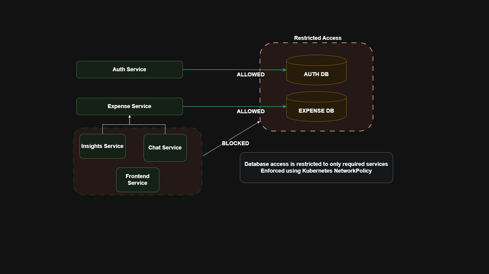

### 10.2 Application UI

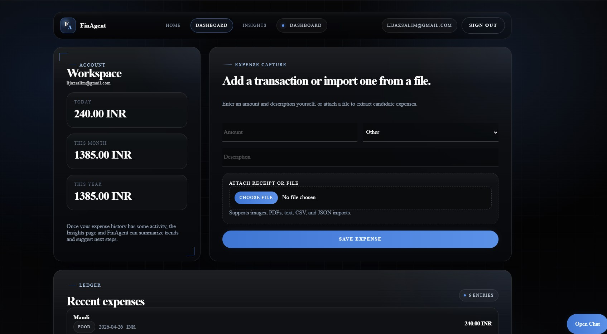

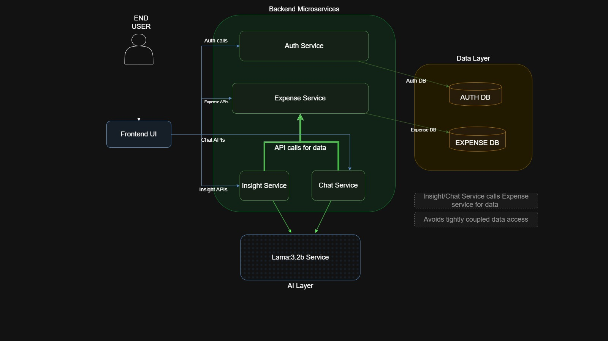


### 10.3 GitHub Actions and Pipeline Evidence

### PR Validation

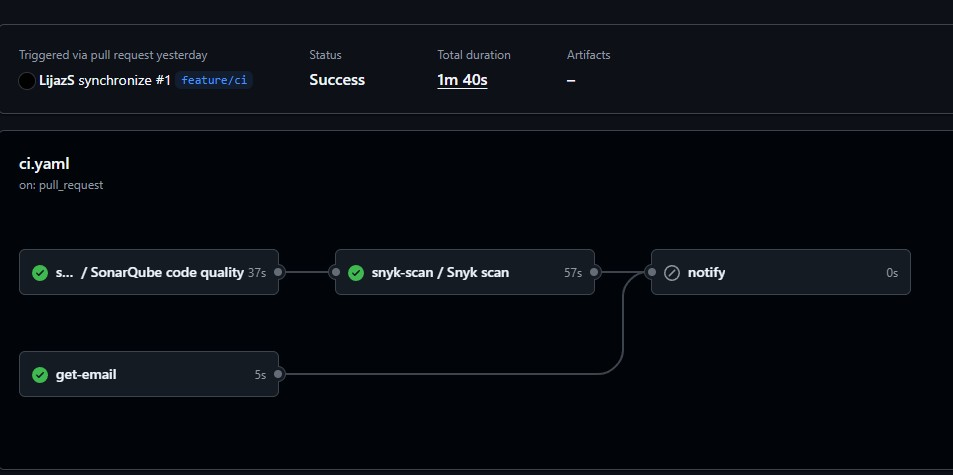

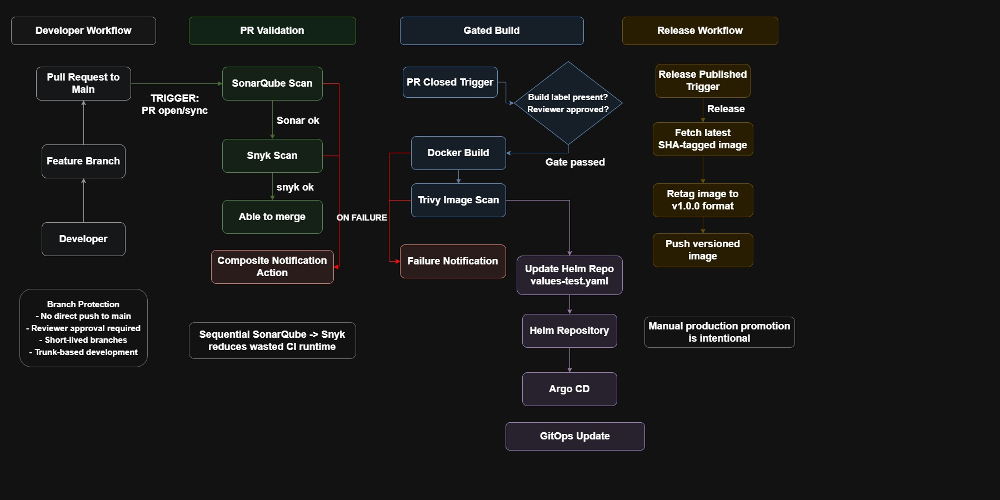

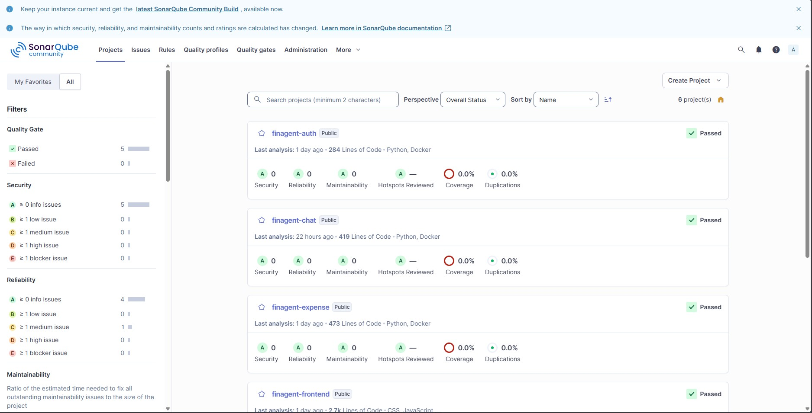


### Image Build / Deployment Update

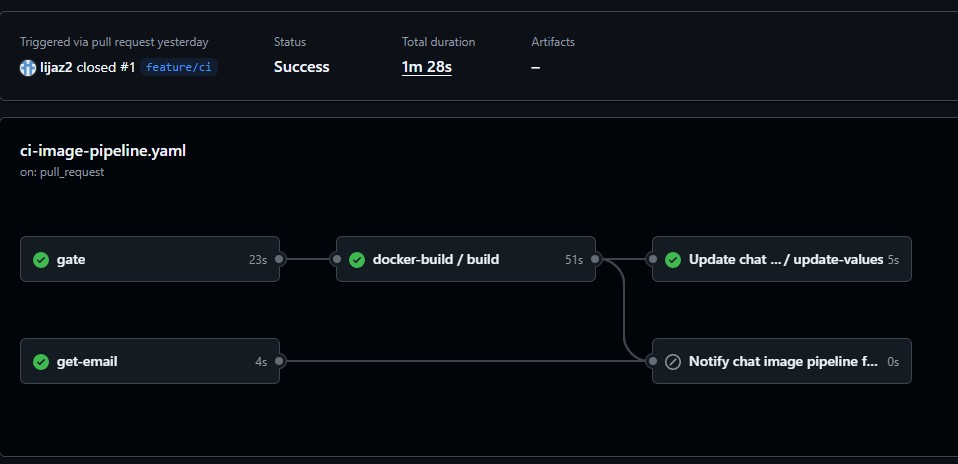

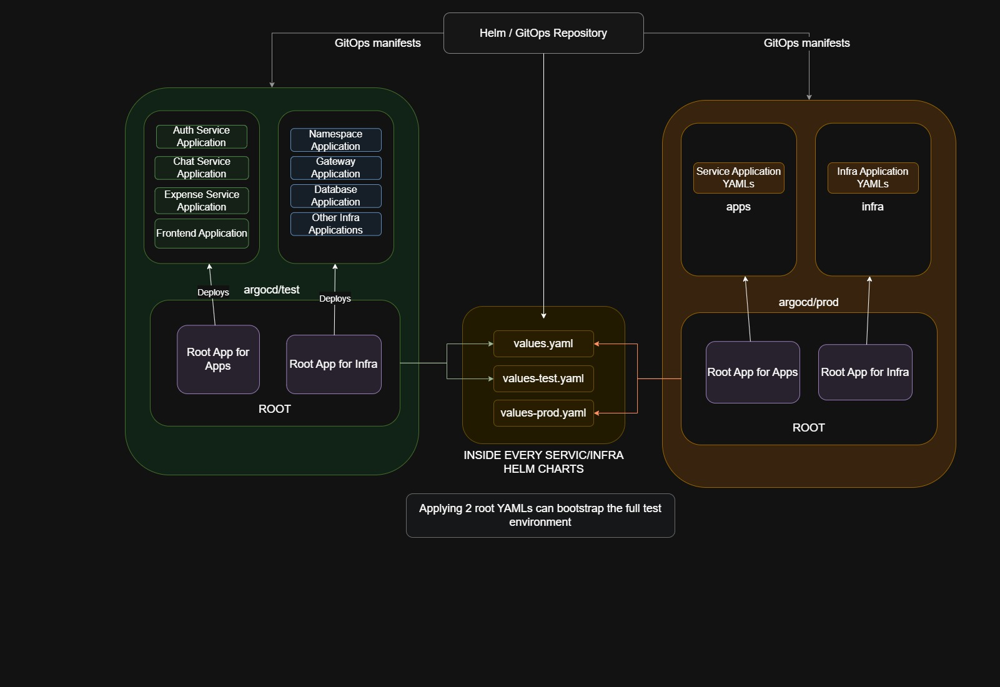

### Release Promotion

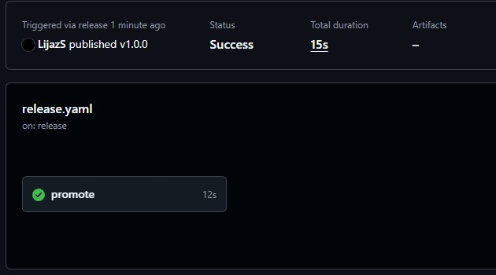


### Policy Validation

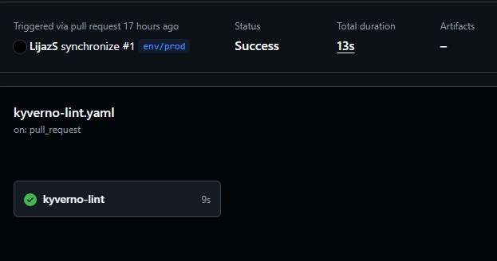

### Notifications


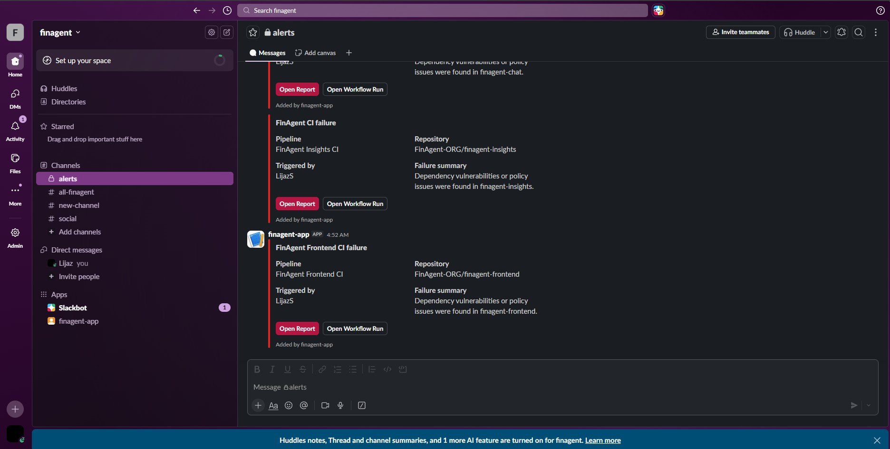

### 10.4 Platform UIs

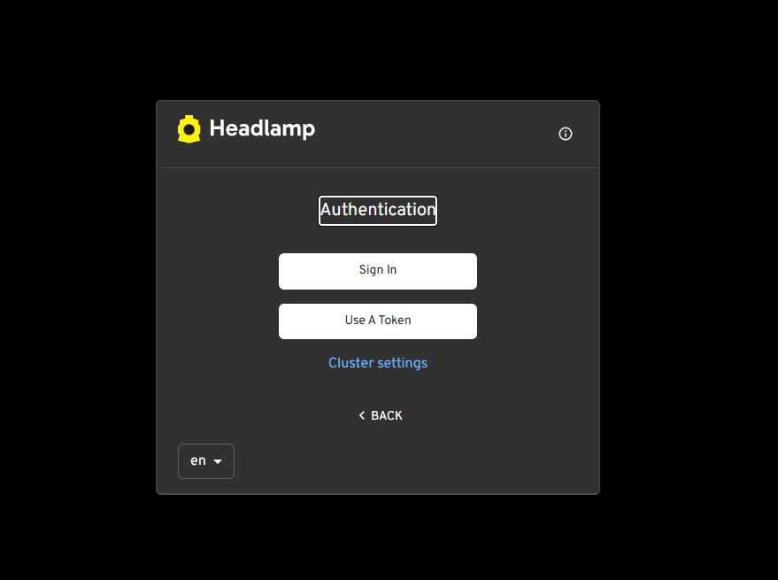

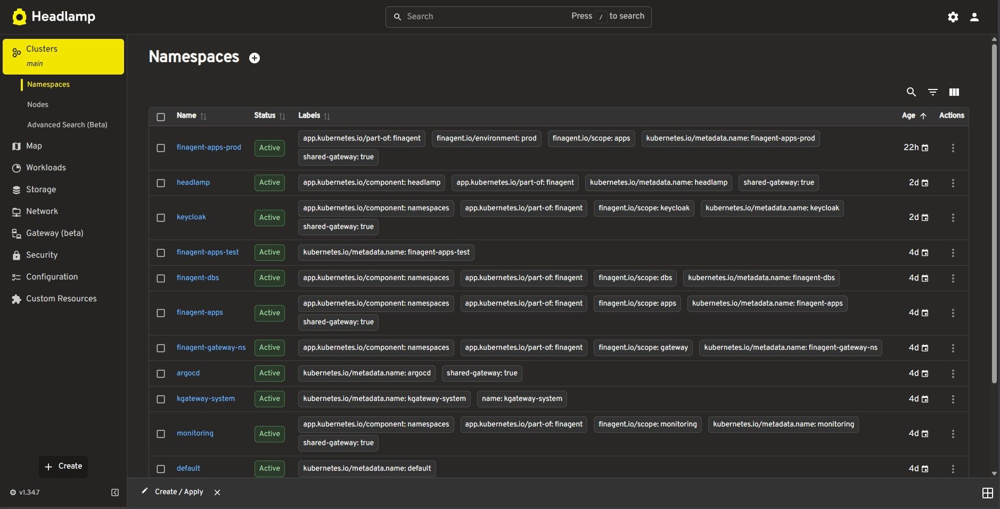

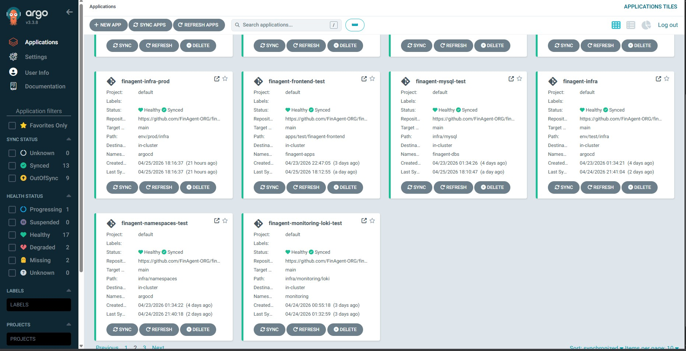


### 10.5 kubectl Output Evidence

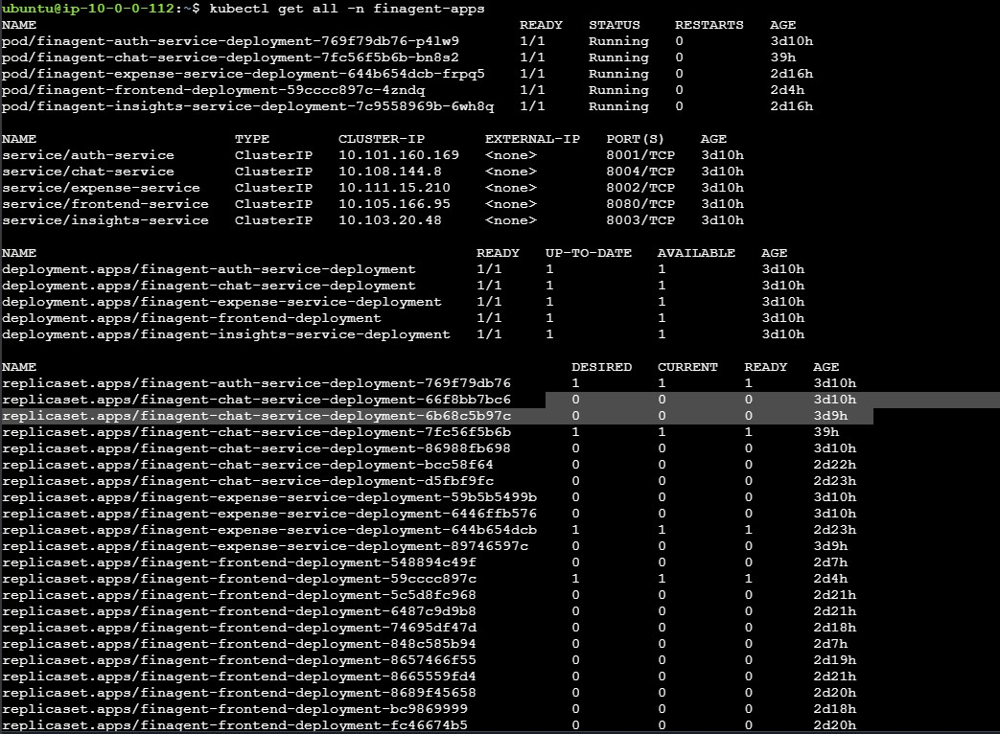

## 11. Operational Notes

- HAProxy and public DNS are part of the deployed environment but are not managed directly by this repo
- this repo manages the in-cluster gateway, routes, applications, and supporting infrastructure
- some platform details in this README, such as the HAProxy edge role and public/private subnet split, come from the current deployed setup context and are intentionally documented here as operational knowledge
- the microservice repos share a common CI/CD pattern; this README references representative examples from the frontend and auth repos
- the current committed build workflow does not actively run Trivy because the Trivy steps are commented out in the reusable Docker build workflow

## 12. Quick Start Checklist

1. Verify namespaces, storage class, gateway, and Argo CD are present.
2. Apply the environment root apps if bootstrapping a cluster.
3. Confirm pods and PVCs are healthy in `finagent-apps`, `finagent-dbs`, and `monitoring`.
4. Verify HTTPRoutes are attached to `finagent-gateway`.
5. Confirm SealedSecrets have been reconciled into Kubernetes Secrets.
6. Validate the domains respond through HAProxy and the in-cluster gateway.
7. Confirm application repos update `values-test.yaml` in this repo after gated merges.
8. Confirm `env/prod` pull requests to `main` pass the Kyverno lint workflow before merge.
